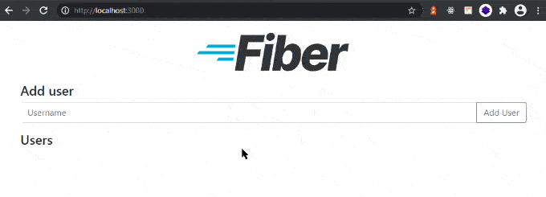

# GoFiber Docker Boilerplate


[](https://gofiber.io/discord)


## IDE Development

### Visual Studio Code

Use the following plugins, in this boilerplate project:
- Name: Go
  - ID: golang.go
  - Description: Rich Go language support for Visual Studio Code
  - Version: 0.29.0
  - Editor: Go Team at Google
  - Link to Marketplace to VS: https://marketplace.visualstudio.com/items?itemName=golang.Go

## Development

### Start the application


```bash
go run app.go
```

### Use local container

```
# Shows all commands
make help

# Clean packages
make clean-packages

# Generate go.mod & go.sum files
make requirements

# Generate docker image
make build

# Generate docker image with no cache
make build-no-cache

# Run the projec in a local container
make up

# Run local container in background
make up-silent

# Run local container in background with prefork
make up-silent-prefork

# Stop container
make stop

# Start container
make start
```

## Production

```bash
docker build -t gofiber .
docker run -d -p 3000:3000 gofiber ./app -prod
```

Go to http://localhost:3000:




## ☕ Supporters

Fiber is an open-source project that runs on donations to pay the bills, e.g., our domain name, hosting, and serverless infrastructure. If you want to support Fiber, please become a [GitHub Sponsor](https://github.com/sponsors/gofiber).

<!-- sponsors -->
### 📅 Monthly Sponsors

<table>
<tr><td valign="top"><strong>🔥 Fiber Guardian</strong></td><td><a href="https://www.coderabbit.ai/?utm_source=cr_org&amp;utm_medium=github" title="@coderabbitai"></a></td></tr>
<tr><td valign="top"><strong>☕ Fiber Supporter</strong></td><td><a href="https://ndole.studio" title="@NdoleStudio"></a>&nbsp;<a href="https://cyberapper.ai" title="@petercool"></a></td></tr>
<tr><td valign="top"><strong>🪴 Fiber Friend</strong></td><td><a href="https://github.com/bsdrop" title="@bsdrop"></a></td></tr>
</table>

### 🎁 One-time Sponsors

<table>
<tr><td valign="top"><strong>🚀 Fiber Hero</strong></td><td><a href="https://www.thanks.dev" title="@thnxdev"></a></td></tr>
</table>
<!-- sponsors -->
